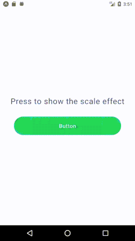

# Touchable Scale Reanimated [](https://img.shields.io/github/package-json/v/ialoig/react-native-touchable-scale-reanimated) [](https://img.shields.io/npm/v/react-native-touchable-scale-reanimated-reanimated?color=red)

### Hi 👋

### `Touchable Scale Reanimated` is a simple React Native component animated with [`Reanimated 2`](https://www.reanimated2.com/) that scale when a gesture is handled

<p align="center">
  
</p>

<div align="center">
  <a href="#GettingStarted">Getting Started</a> &nbsp;|&nbsp;
  <a href="#Properties">Properties</a> &nbsp;|&nbsp;
  <a href="#Example">Example</a> &nbsp;
</div>

<h1 id="Getting-Started">🚀 Getting Started</h1>

## Prerequisites

* [React Native](https://facebook.github.io/react-native/docs/getting-started.html)
* [Node v14.17.1](https://nodejs.org/en/)
* [Reanimated 2](https://docs.swmansion.com/react-native-reanimated/)

## Install

```shell
npm install react-native-touchable-scale-reanimated
```

<h1 id="Properties">📝 Properties</h1>

### Touchable Scale Reanimated

| Property                      | Type                                                  | Optional |  Default                                                                                                                                                                                       | Description                                              |
| :-----: | :---------------------------------------------------: | :-------:| :-----------------------------------------------: | :--------------------:|
| `style`| `array or object`|Yes| `-`| Style definition of the component we want to render|
| `children`| `array or object`|No|`-`| Component|
| `onPress`| `func`|Yes|`-`| Function to be called when onPress event is handled|
| `scaleValue`| `number`|Yes|`0.95`| Set how much you want to scale the component|
| `durationValue`|`number`|Yes| `150`| Set the scale duration|

<h1 id="Example">Example</h1>

You can find an example under the folder `/example/button-scale/`.

Run installation from here

```shell
npm install react-native-touchable-scale-reanimated
```

Run app with the following command package version

```shell
npm start
```

Here you can find a defined component (ie. Button ), wrapped with the Touchable Scale component:

```jsx
import React from 'react'
import TouchableScale from "../TouchableScale"

function Button ({ title, type, size, border, onPress }) {

  return (
    <TouchableScale 
      onPress={onPress} 
      style={[ button.button, button[type], button[size], border ? button.border : null ]]}>
      <Text style={[ text.button, text[type]]}>
        {title}
      </Text>
    </TouchableScale>
  )
}

export default Button
```

---
made with 💪 by ialoig
